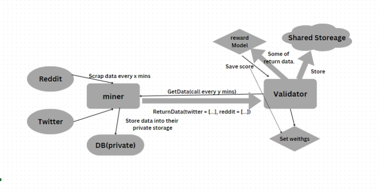

<div align="center">

# **Scraping Subnet** <!-- omit in toc -->
[](https://discord.gg/bittensor)
[](https://opensource.org/licenses/MIT) 


### The Incentivized Internet <!-- omit in toc -->

[Discord](https://discord.gg/bittensor) • [Network](https://taostats.io/) • [Research](https://bittensor.com/whitepaper)

</div>


This repo contains all the necessary files and functions to define Scraping subnet incentive mechanisms. You can run this project in three ways,
on Bittensor's main-network (real TAO, to be released), Bittensor's test-network (fake TAO), or with your own staging-network. This repo includes instructions for doing all three.

# Introduction

Data scraping plays a pivotal role in many AI and machine learning models, often serving as the partial layer for various subnets, including s1. We aim to extract data from platforms like Reddit, Twitter, and other social media sites, consolidating this information into shared storage solutions like Weights & Biases (wandb). In the future, we plan to utilize the storage subnet of Bittensor to enhance our data storage capabilities. 




- `scraping/protocol.py`: The file where the wire-protocol used by miners and validators is defined.
- `neurons/miner.py`: This script which defines the miner's behavior, i.e., how the miner responds to requests from validators.
- `neurons/validator.py`: This script which defines the validator's behavior, i.e., how the validator requests information from miners and determines scores.


# Installation
This repository requires python3.8 or higher. To install, simply clone this repository and install the requirements.

## Install Bittensor
```bash
$ /bin/bash -c "$(curl -fsSL https://raw.githubusercontent.com/opentensor/bittensor/master/scripts/install.sh)"
```
## Install Dependencies
```bash
git clone https://github.com/gitphantomman/scraping_subnet.git
cd scraping_subnet
python -m pip install -r requirements.txt
python -m pip install -e .
```


# Running Miner

## Prerequisites

For mining you need twitter developer account. If you don't have one, you can obtain it from the [Twitter Developer Portal](https://developer.twitter.com/en/portal/products).
And also you need reddit developer account. If you don't have one, you can obtain it from the [Reddit Developer Portal](https://www.reddit.com/prefs/apps).

## Running Scraping Script (Twitter & Reddit)

A miner periodically scrapes data from Twitter, at intervals of every 15 seconds, and stores this data in a local database. To perform this operation, a Twitter developer account is required. If you do not have one, you can obtain it from the [Twitter Developer Portal](https://developer.twitter.com/en/portal/products).
The scraped data is then saved to `neurons/twitter_data.db` and `neurons/reddit_data.db`. This allows the miner to respond to queries from the validator using the data stored in this database.

1. You have to set environment variables in dotenv file. You can use the `.env.example` file as a template.
```bash
# PRAW Credentials
# Reddit Personal use script (14 characters)
CLIENT_ID=

# Reddit Secret key (27 characters)
CLIENT_SECRET=

# Reddit App name
USER_AGENT=

# Reddit username
REDDIT_USERNAME=

# Reddit password
REDDIT_PASSWORD=

# Twitter Credentials
# Twitter TOKEN 
BEARER_TOKEN= 
```

2. Run the scraping scripts.
```bash
# To run the scraping script
cd neurons
python twitterScrap.py 
python redditScrap.py
```

3. If you want to run twitter scraping script as a **cron job**.

An example to scrape twitter every 6 hours. Edit your crontab with command `crontab -e`. Please note, your `python` and `twitterScrap.py` locations may (most likely!) vary, so adjust accordingly. 
```bash
# Set variables
BEARER_TOKEN=<token from twitter>
SINGLE_RUN=true
# Number of twits to fetch per request
R_LIMIT=100
0 */6 * * * python neurons/twitterScrap.py > ~/twitter_scraper.log
```


## Running Miner Script
A miner periodically extracts specified data from Twitter using scraping tools or APIs, store this data securely, and then retrieve and provide this data in response to queries from validators, who evaluate the data based on predetermined criteria.

```bash
# To run the miner
cd neurons
python miner.py 
    --netuid <your netuid>  # The subnet id you want to connect to
    --subtensor.network <your chain url>  # blockchain endpoint you want to connect
    --wallet.name <your miner wallet> # name of your wallet
    --wallet.hotkey <your miner hotkey> # hotkey name of your wallet
    --logging.debug # Run in debug mode, alternatively --logging.trace for trace mode
```

Tip:

    1. You can use multiple keys for scraping many data.
    2. You can change keywords for scraping different data. (Default: 'tao') Of course, you can change every epoch. They are defined in `neurons/twitterScrap.py` and `neurons/redditScrap.py` file.
    3. You can set number of data to respond to queries from validators. (Default: 500) They are defined in `neurons/miner.py` file.
    4. You can change other parameters for your higher score.

# Running Validator

The validator issues queries to miners for data, compute scores for the provided data based on uniqueness, rarity, or volume, transfer this scored data to a communal distributed storage system, and adjust weights according to the normalized scores of the miners.

## Prerequisites

1. You need wandb account. If you don't have one, you can obtain it from the [wandb](https://wandb.ai/authorize).
2. Then you have to initialize wandb using `wandb login` command.

    ```bash
    pip install wandb
    wandb login
    ```
3. You have to create a project in wandb. You can use the `scraping_subnet` project as a template.


## Running Validator Script

```bash
cd neurons
# To run the validator
python validator.py 
    --netuid <your netuid> # The subnet id you want to connect to
    --subtensor.network <your chain url> # blockchain endpoint you want to connect
    --wallet.name <your validator wallet>  # name of your wallet
    --wallet.hotkey <your validator hotkey> # hotkey name of your wallet
    --wandb.username <your wandb username> # your wandb username
    --wandb.project <your wandb project name> # the wandb project name you want to save to (Default: zhjgapym)
    --wandb.override_config # Boolean flag that, when set (override) the `wandb_config.json` with command line arguments. (default: False)
    --logging.debug # Run in debug mode, alternatively --logging.trace for trace mode
```

---

## License
This repository is licensed under the MIT License.
```text
# The MIT License (MIT)
# Copyright © 2023 Chris Wilson

# Permission is hereby granted, free of charge, to any person obtaining a copy of this software and associated
# documentation files (the “Software”), to deal in the Software without restriction, including without limitation
# the rights to use, copy, modify, merge, publish, distribute, sublicense, and/or sell copies of the Software,
# and to permit persons to whom the Software is furnished to do so, subject to the following conditions:

# The above copyright notice and this permission notice shall be included in all copies or substantial portions of
# the Software.

# THE SOFTWARE IS PROVIDED “AS IS”, WITHOUT WARRANTY OF ANY KIND, EXPRESS OR IMPLIED, INCLUDING BUT NOT LIMITED TO
# THE WARRANTIES OF MERCHANTABILITY, FITNESS FOR A PARTICULAR PURPOSE AND NONINFRINGEMENT. IN NO EVENT SHALL
# THE AUTHORS OR COPYRIGHT HOLDERS BE LIABLE FOR ANY CLAIM, DAMAGES OR OTHER LIABILITY, WHETHER IN AN ACTION
# OF CONTRACT, TORT OR OTHERWISE, ARISING FROM, OUT OF OR IN CONNECTION WITH THE SOFTWARE OR THE USE OR OTHER
# DEALINGS IN THE SOFTWARE.
```


python miner.py --wallet.name test_miner --wallet.hotkey test_miner_1 --subtensor.network test --netuid 18